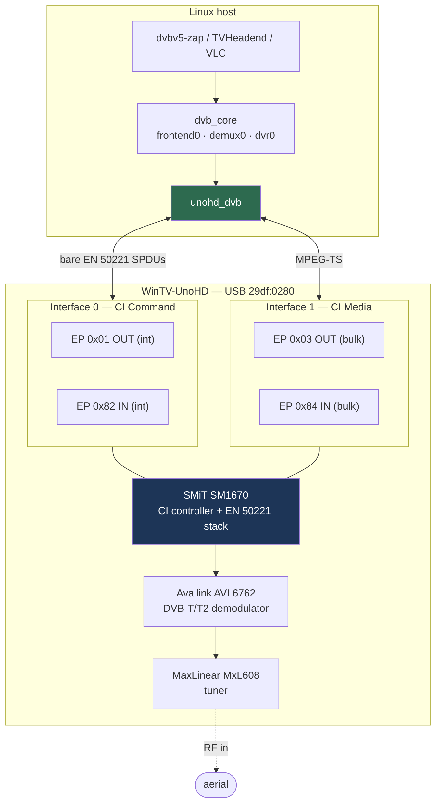

# How it works, and the quirks that matter

Most USB DVB sticks are a demodulator and a tuner behind a simple USB bridge,
and a Linux driver pokes registers over control transfers. The WinTV-UnoHD is
not that. It is a **Common Interface module** — the same class of thing as a
CAM you would slot into a TV — with a DVB-T/T2 front end behind it, and the
front end is only reachable by talking **EN 50221** to the CI module.

That single fact explains almost every unusual thing in this driver.

## Architecture



The driver's job is to be a **CI host**: bring the session layer up, answer the
module's resource requests, and then send tuner commands as SMiT private TLVs
inside a CI+ SAS channel. Tuning a mux is a message exchange with a small
computer, not a register write.

## The wire model

EN 50221 normally has a link layer and a transport layer under the session
layer. Here there are neither. The USB interrupt endpoints carry **bare
SPDUs**, one per transfer:

```
host   -> device : interrupt OUT, EP 0x01   (ZLP if length % 512 == 0)
device -> host   : interrupt IN,  EP 0x82
```

The USB endpoints already provide the framing and reliability that the link
and transport layers exist to provide, so the vendor simply left them out.

Above that it is ordinary EN 50221: `open_session_request` / `open_session_
response`, then APDUs. The module opens Resource Manager, Application
Information, Date/Time, its own private resource `0x00961001`, and one more
that matters a great deal (below). The host completes a **CI+ SAS** handshake
against application id `SMiTZBJL`, and tuner commands ride inside
`sas_async_msg`.

## Quirk 1 — the content-protection resource must be refused

This is the one that mattered most, and it cost the most time to find.

The module also opens a session on its private **content-protection** resource
`0xFCC00011`. While that exchange is outstanding, the module's application
**accepts every tuner command and silently discards it**. Tune, get-status,
get-lock — all acknowledged, all ignored. No error, no timeout, nothing to
suggest the commands were even unwelcome.

The fix is to refuse the resource: answer its `open_session_request` with
status `0xF0` (*resource not found*) and leave it out of `profile_reply`. The
module then falls back and answers every command immediately.

```
open_session_request  0xFCC00011  ->  open_session_response  0xF0
```

To be explicit about what this is and is not: `0xFCC00011` is CI+ content
protection, which requires a real device certificate the driver does not have
and does not attempt to obtain. Declining it means the driver is **not** a
content-protection-capable host, so it receives **free-to-air broadcasts
only**. Nothing here descrambles, circumvents or weakens any protection — it
declines to participate, which is the honest answer for a free-to-air driver
and happens also to be the one that makes the tuner respond.

## Quirk 2 — claim the media interface *first*

Interface 1 carries the transport stream on bulk endpoint `0x84`. If you claim
it *after* bringing the session layer up, it delivers **zero bytes, for ever** —
with no error anywhere.

Claim interface 1 before EN 50221 bring-up, `clear_halt()` endpoint `0x84`, and
the stream flows. There is no start-of-stream command; the vendor protocol has
no such tag. The stream simply follows a successful tune.

## Quirk 3 — DVB-T2 needs a real PLP id

For DVB-T2, `0xFFFF` is not "any PLP". Send it and the demodulator reports a
*perfect* lock — full strength, quality 100, `nplp=1`, `plp[0]=0` — and emits
no transport stream at all. Send the actual PLP id and the same mux streams at
full rate.

A lock with no data is the confusing failure mode here, and this is the usual
cause.

## Quirk 4 — `SET_INTERFACE` wedges the device

The stick rejects `SET_INTERFACE`, and issuing it wedges **both** endpoints
until the device is reset. Each interface has exactly one altsetting, so there
is never a reason to send it. The driver does not.

## Quirk 5 — the device needs a reset before it will talk

A freshly enumerated stick does not re-announce its CI sessions to a new host
stack. The driver issues one `usb_reset_device()` on probe so the module starts
its announcement sequence from the top, then skips the reset on the probe that
follows re-enumeration.

That "have I just reset this one?" state is **per device**, keyed by bus number
and port path. Keeping it in a single global slot works with one stick and
livelocks with two: probe(A) records A and resets it, probe(B) overwrites the
slot and resets B, A re-enumerates, the slot still says B, so A is reset
again — for ever.

## Quirk 6 — adapter numbers are not stable

DVB adapter numbers are assigned in probe order. With two sticks, which one
becomes `adapter3` and which `adapter4` depends on enumeration order and
changes across reloads. Use the udev rule in `udev/` if you need stable names.

## Quirk 7 — it goes to sleep if you ignore it

The module stops servicing its session entirely after a few minutes in which
the host sends it no commands. It does not report an error — it simply stops
answering, at the session layer, so a tune and a status read both time out and
nothing at all arrives on the interrupt endpoint. Only a USB reset and a fresh
session announcement bring it back; reopening `frontend0` does not.

Measured on this hardware: 120 s of silence was safe, 240 s was not.

The obvious explanation turned out to be wrong. EN 50221 §8.5.4 lets a module
ask the host to repeat `date_time` unprompted every `response_interval`
seconds, and this driver originally answered `date_time_enq` only when asked —
a tidy story. Instrumenting the field showed the module asks for an interval of
zero. Whatever watchdog it runs, it is not that one.

The driver sends a `GSTA` status read once a minute when nothing else has gone
out. It is the same read a tuned adapter makes constantly, so a streaming
adapter adds no traffic at all.

## Lifecycle, and why the driver defers its own teardown

`dvb_register_frontend()` deliberately leaves the frontend's reference count at
two, and every `open()` of `frontend0` adds another. `dvb_frontend_detach()`
does **not** wait for the application to close the device. So a disconnect
while something holds `frontend0` open drops the count to one, not zero — and
if the driver frees its state there, the eventual `close()` walks freed memory
inside `dvb_frontend_release()`.

The sanctioned hook for this is `fe->ops.release`, and it is unusable in a
self-contained module: with `CONFIG_MEDIA_ATTACH=y`,
`dvb_frontend_invoke_release()` follows it with `symbol_put_addr()`, dropping a
module reference that `dvb_attach()` never took.

So the driver frees its state only when the frontend's reference count has
actually reached zero, and otherwise parks it on a list drained at module
unload. That is safe because an open DVB device node pins the module
(`dvbdev` sets `fops->owner` to the adapter's module), so module unload cannot
run while any descriptor is still open.

This is described at greater length, with the crash that found it, in
[`write-up.md`](write-up.md).
